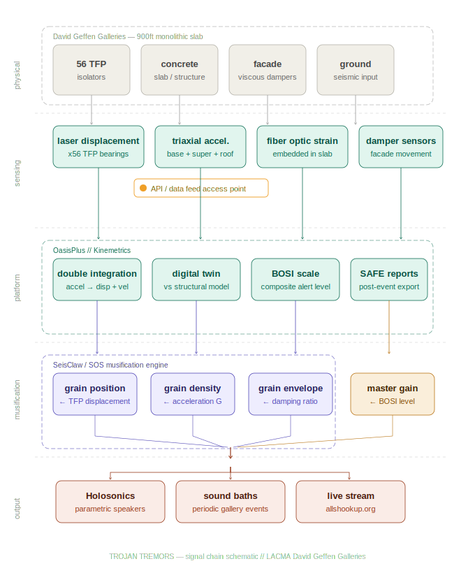

# LACMA David Geffen Galleries — Seismic Musification
## TROJAN TREMORS // OasisPlus Data Pipeline Reference

*Kinemetrics OasisPlus: https://www.oasisplus.kmi.com/*  
*SOM / LACMA Unframed: https://unframed.lacma.org/2022/02/16/earthquakes-sliders-and-art*

---

## 1. Building Specs

- **Structure:** 900-foot monolithic elevated concrete slab
- **Isolators:** 56 Triple Friction Pendulum (TFP) bearings in specialized pits
- **Design movement:** up to 60 inches (5 feet) in any horizontal direction
- **Structural engineer:** SOM
- **Facade:** independent movement via pinned connections and viscous dampers
- **SHM platform:** OasisPlus by Kinemetrics (global SHM market leader since 1969)

---

## 2. OasisPlus — Platform Overview

OasisPlus is a real-time earthquake business continuity platform. It operates continuously — before, during, and after seismic events — not as a passive logger.

**Three operating layers:**

| Layer | Function |
|---|---|
| **Sensing** | Triaxial accelerometers, laser displacement transducers, fiber optic strain gauges — continuous acquisition |
| **Processing** | Double integration of acceleration → real-time displacement + velocity; performance comparison against structural digital twin |
| **Output** | Management Console (web), SAFE Reports, BOSI alert scale, Mobile App |

**Key platform components:**

- **Management Console** — web dashboard with real-time sensor data and zone-level alert status
- **SAFE Reports** — automated post-event structural assessment; includes inter-story drift, structural/nonstructural heatmap, raw sensor time-series
- **BOSI Scale** — Building Occupant Shake Impact: single composite value encoding structural, nonstructural, and occupant impact
- **Digital twin** — live sensor data compared against SOM's original structural model in real time
- **ShakeAlert integration** — USGS-licensed earthquake early warning; pre-shaking alert before P-wave arrival

---

## 3. Sensor Network at Geffen

| Sensor | Location | Data Stream |
|---|---|---|
| Triaxial accelerometers (Kinemetrics) | Below isolators (ground), superstructure, roof | Acceleration X/Y/Z — continuous |
| Laser displacement transducers | Each of 56 TFP bearings | Per-isolator slide distance |
| Fiber optic strain gauges | Embedded in concrete slab | Internal stress, shrinkage state |
| Viscous damper sensors | Facade connection points | Facade movement (independent of slab) |

OasisPlus performs **double integration** on acceleration data in real time, deriving displacement and velocity — both raw and processed streams are available.

---

## 4. Signal Chain Schematic

---

## 5. Data → Sound Mapping

| Data Stream | Musification Target | Rationale |
|---|---|---|
| TFP isolator displacement | Grain position in source sample | Isolator slide directly drives granular scrub position |
| Peak acceleration (G) | Grain density (grains/sec) | Higher shaking = denser, more chaotic texture |
| Damping ratio | Grain envelope duration/decay | High damping = short plucky grains; low = long overlapping blur |
| Inter-story drift | Spectral filter cutoff | Structural deformation shapes timbral character |
| Fiber optic strain | Slow LFO modulation | Sub-audio slab breath — long-term texture shift |
| BOSI level | Master amplitude / state flag | Green = ambient; Yellow = active; Red = full intensity |

**Why granular synthesis:** TFP bearings physically grind and slide. Granular synthesis captures that mechanical character — grains sound like a physical object moving across a surface. Simple pitch-shifting does not.

---

## 6. Post-Event Data — SAFE Reports

Triggered automatically on any qualifying seismic event:

1. Structural heatmap — alert levels per building zone
2. Inter-story drift values per floor
3. BOSI scale composite rating
4. Raw sensor time-series (acceleration, displacement)
5. Nonstructural impact assessment
6. Occupant impact estimate

SAFE Reports include raw engineering data exportable to structural analysis partners — the most likely access point for time-series extraction post-event.

---

## 7. Access Path

**Primary platform:** OasisPlus Management Console — Kinemetrics

- Web-based; real-time sensor feeds visible to authorized users
- SAFE Reports exportable post-event (time-series + engineering data)
- API access: not publicly documented — requires direct engagement with Kinemetrics

**Contact sequence:**

1. **LACMA Facilities** — confirm OasisPlus is the live system, identify internal data custodian
2. **Kinemetrics / KMI** — `oasisplus.kmi.com/contact` — query read-only API or data export access for research/art use
3. **SOM structural engineering** — may hold digital twin model and historical sensor datasets from construction phase

**Data formats to request:**

- Real-time: JSON stream or websocket feed from OasisPlus console
- Post-event: SAFE Report time-series export (CSV or equivalent)
- Historical: construction-phase SHM data (isolator unlock sequence, 2022–2025)

---

## 8. SeisClaw / SOS Integration Notes

- Pure MiniSEED binary parsing — no ObsPy dependency
- Direct waveform/sensor data → granular sonification pipeline
- Grain parameters driven by OasisPlus output streams (displacement, acceleration, BOSI)
- Target outputs: Holosonics parametric speakers (gallery), periodic Seismic Sound Baths, continuous live stream at allshookup.org

---

